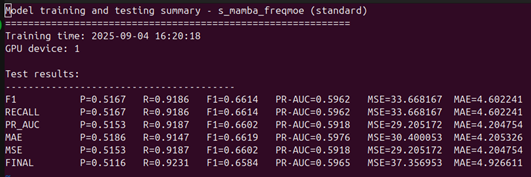

# Wildfire Forecasting Model Training System - User Guide

## 1. Environment Requirements

### 1.1 Python Version
- Recommended: Python 3.10

### 1.2 CUDA Environment
- Requires NVIDIA GPU and CUDA drivers, recommended CUDA 11.8
- Driver and CUDA Toolkit must be compatible with your PyTorch version

### 1.3 Required Dependencies
Please strictly follow the installation order below to ensure environment consistency.

#### 1.3.1 Create a new conda environment
```bash
conda create -n wildfire python=3.10 -y
conda activate wildfire
```

#### 1.3.2 Install PyTorch (with CUDA support)
```bash
conda install pytorch torchvision torchaudio pytorch-cuda=11.8 -c pytorch -c nvidia
```

#### 1.3.3 Install core dependencies
```bash
conda install numpy pandas scikit-learn tqdm h5py matplotlib
pip install wandb
```

#### 1.3.4 Install Mamba model dependencies (required for s_mamba/Mamba series)
```bash
pip install mamba-ssm
```

#### 1.3.5 Other notes
- It is recommended to use conda/pip for all dependencies to avoid version conflicts.
- If you need wandb experiment tracking, register and run `wandb login` in advance.

## 2. Data Preparation

### 2.1 Data Directory Structure
- All HDF5 data files should be placed in:
  ```
  /mnt/raid/zhengsen/wildfire_dataset/self_built_materials/full_datasets/
  ```

### 2.2 Data File Naming and Content
- Data can be found at Google Drive: https://drive.google.com/drive/u/1/folders/1VcZnj0DW2pTUf08mGLluE9l-HLTSsYDx
- File name format: `{year}_year_dataset.h5`, e.g. `2020_year_dataset.h5`
- Each file contains all pixels' multi-channel data for the whole year
- Dataset name: `{row}_{col}`, e.g. `37_255`
- Data shape: (39, 365) or (39, 366)
- Channel 0 is FIRMS fire data, float type

### 2.3 Caching Mechanism
- The first run will automatically generate sampling cache files in `full_datasets/cache/`, no manual operation required

## 3. Model Training

### 3.1 Train a Single Model
```bash
# Train a specific model
python train_single_model.py --model DLinear --model-type standard

# List available models
python train_single_model.py --list-models
```
- Suitable for testing or debugging a single model

### 3.2 Sequential Batch Training
```bash
# Train all standard models (sequential)
python train_all_models_combined.py --force-retrain
```
- Automatically trains all models, covering all mainstream time series architectures
- Standard model results are saved in `/mnt/raid/zhengsen/pths/7to1_Focal_woFirms_onlyFirmsLoss_newloadertest/`

### 3.3 Parallel Training (Recommended)
```bash
# Automatically assign models to GPUs for parallel training
python smart_parallel.py

# Specify number of GPUs
python smart_parallel.py --num-gpus 4

# Specify max parallel tasks per GPU
python smart_parallel.py --max-parallel-per-gpu 2
```
- **Recommended**: Automatically allocates GPU resources, greatly improving training efficiency
- Intelligent load balancing, avoids GPU resource waste
- Supports resume, automatically skips already trained models

### 3.4 Training Script Comparison

| Script Name | Scenario | Advantages | Disadvantages |
|------------|----------|------------|---------------|
| `train_single_model.py` | Single model debug/test | Fast validation, parameter tuning | Cannot batch process |
| `train_all_models_combined.py` | Full experiment, result comparison | Complete features, unified results | Long training time, low resource utilization |
| `smart_parallel.py` | Production, large-scale training | Efficient parallelism, smart scheduling | Slightly more complex config |

### 3.5 Training Parameter Notes
- All parameters can be viewed via `python train_all_models_combined.py --help`
- Common parameters:
  - `--firms-weight`: FIRMS loss weight
  - `--other-drivers-weight`: Other drivers loss weight
  - `--loss-type`: Loss function type (focal/kldiv/multitask)
  - `--enable-position-features`: Enable position features
  - `--enable-future-weather`: Enable future weather features
  - `--weather-channels`: Weather channel range (e.g. 1-12)

## 4. Prediction Visualization

### 4.1 Generate Prediction Visualizations
```bash
# Visualize prediction results for a specific model
python test_and_visualize_optimized.py --model DLinear --model-type standard

# Visualize and compare multiple models
python test_and_visualize_optimized.py --model Mamba --model-type standard --save-comparison

# Generate prediction results for specific time windows
python test_and_visualize_optimized.py --model iTransformer --window-range 1-10

# Batch visualize all model results
python test_and_visualize_full.py
```

### 4.2 Visualization Output
- Automatically generates TIFF format prediction images
- Includes ground truth vs prediction comparison
- Generates quantitative evaluation metrics (precision, recall, F1 score, etc.)
- Supports batch processing of multiple time windows

## 5. Runtime Environment & Notes
- Recommended to run on Linux server (e.g. Ubuntu 20.04) with sufficient GPU memory (24GB+ recommended)
- Training scripts auto-detect CUDA devices, no need to specify manually
- To specify GPU, set the `CUDA_VISIBLE_DEVICES` environment variable
- For wandb tracking, run `wandb login` in advance, or disable WandB in scripts if not needed
- For Mamba series models, must run in an environment with `mamba-ssm` installed

## 6. FAQ
- **Slow data loading/high memory usage**: First sampling is slow, subsequent runs are fast. SSD recommended.
- **Mamba model errors**: Ensure `mamba-ssm` is installed and running in the correct environment.
- **Out of GPU memory**: Reduce `batch_size`, or only train standard models.
- **wandb issues**: Disable WandB in scripts if not needed.
- **Data path/naming errors**: Strictly follow the above directory and naming conventions.

---
For environment or training issues, please contact the maintainer or submit an issue. 

## ToDo List

### Model Enhancements
- [ ] **Fourier/Wavelet/Laplace + Mamba**: Integrate frequency domain decomposition with Mamba architecture
- [ ] **Patchify Time Series Data**: Implement TimiXer-style temporal patching for better long-range modeling
- [ ] **Better MOE**: Enhance Mixture of Experts (MoME) implementation for improved performance

### Data Processing
- [ ] **Data Missing**: Handle missing data scenarios and implement robust imputation strategies
- [ ] **Endogenous and Exogenous Variables**: Improve handling of internal and external variables

---

## Recommended Readings

### Recent Papers on Time Series Forecasting

1. **FLDmamba**: Integrating Fourier and Laplace Transform Decomposition with Mamba for Enhanced Time Series Prediction
   - *Key focus: Frequency domain decomposition with Mamba architecture*

2. **SpoT-Mamba**: Learning Long-Range Dependency on Spatio-Temporal Graphs with Selective State Spaces
   - *Paper: [arXiv:2406.11244](https://arxiv.org/html/2406.11244v1)*
   - *Key focus: Spatio-temporal modeling with selective state spaces*

3. **Affirm**: Interactive Mamba with Adaptive Fourier Filters for Long-term Time Series Forecasting
   - *Paper: [AAAI 2024](https://ojs.aaai.org/index.php/AAAI/article/view/35463)*
   - *Key focus: Adaptive Fourier filters for long-term forecasting*

4. **T-Mamba**: A Unified Framework with Long-Range Dependency in Dual-Domain for 2D & 3D Tooth Segmentation
   - *Paper: [arXiv:2404.01065](https://arxiv.org/abs/2404.01065)*
   - *Key focus: Dual-domain modeling for medical imaging*

5. **TimeXer**: Empowering Transformers for Time Series Forecasting with Exogenous Variables
   - *Paper: [arXiv:2402.19072](https://arxiv.org/pdf/2402.19072)*
   - *Key focus: Transformer architecture with exogenous variable integration*

6. **MoME**: Mixture of Multi-Domain Experts for Multivariate Long-Term Series Forecasting
   - *Paper: [IEEE](https://ieeexplore.ieee.org/abstract/document/10887716)*
   - *Key focus: Multi-domain expert mixture for multivariate forecasting*

### Implementation Notes
- These papers provide valuable insights for enhancing the current wildfire forecasting framework
- Focus areas include: frequency domain methods, spatio-temporal modeling, and expert mixture approaches 

## Mabel's Results
### Baseline model

### Best model


## Key Innovations
1. Multitask BCE loss/arctan loss (Inspired by [Nature](https://www.nature.com/articles/s41598-025-95529-2))
2. Endogenous/Exogenous Cross Attention inspired by TimeXer (**greatest impact**)

